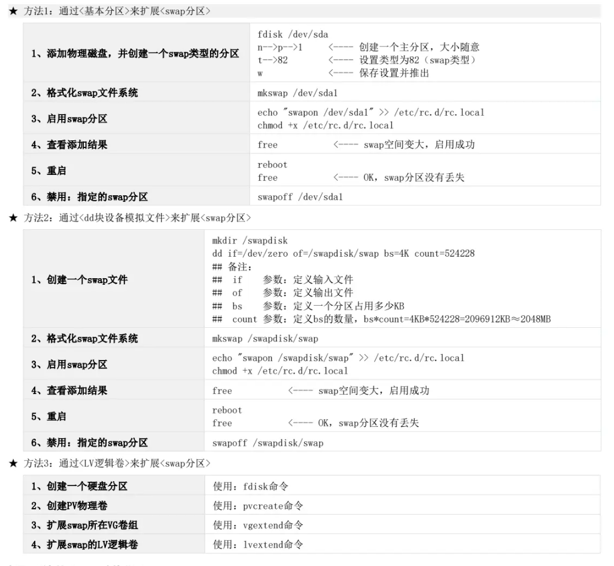

---

## 一、管理 SWAP 交换分区

1. **创建: SWAP 交换分区**
	
2. **启用: 所有的 SWAP 交换分区**
    ```bash
    swapon -a   ## 启用: 所有的 SWAP 交换分区
    ```

3. **禁用: 所有的 SWAP 交换分区**
    ```bash
    swapoff -a   ## 禁用: 所有的 SWAP 交换分区
    ```
