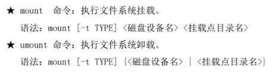

---

### 一、了解: 挂载的核心概念
挂载 (Mount) 是将一个存储设备（如硬盘分区、U盘、网络共享等）及其上的文件系统，关联到 Linux 文件系统树中的一个已存在的目录（挂载点）上的过程。挂载完成后，通过访问这个目录，就可以访问到该存储设备上的数据。

---

### 二、手动挂载与卸载
此部分介绍使用 `mount` 和 `umount` 命令进行临时的、手动的挂载与卸载操作。这些挂载在系统重启后会失效。


*   **`mount` 命令: 手动挂载**
    *   **功能**: 将各类文件系统关联到指定的挂载点。
    *   **核心示例 (挂载本地设备)**:
        ```bash
        # 挂载磁盘分区或LV
        mount -t xfs /dev/sdb1 /mnt/data
        # 挂载目录
        mount --bind /dir01 /dir02
        ```
    *   **核心示例 (网络挂载)**:
    *   **核心示例 (loop还回挂载)**:
*   **`umount` 命令: 手动卸载**
    *   **功能**: 解除设备与挂载点的关联。
    *   **核心示例**:
        ```bash
        # 通过设备名卸载
        umount /dev/sdb1
        # 或通过挂载点卸载
        umount /mnt/data
        ```

---

### 三、自动挂载与持久化
此部分介绍如何配置系统，使其在启动时自动挂载文件系统，实现持久化。

*   **/etc/fstab 文件: 开机自动挂载**
    *   **功能**: 这是一个系统配置文件，定义了系统启动时需要自动挂载的文件系统。内核会读取此文件来执行挂载操作。
    *   **文件格式 (六个字段)**:
        1.  **设备标识**: 设备文件路径 (`/dev/sdb1`)、UUID 或 LABEL。**推荐使用 UUID** 以免设备名变化导致挂载失败。
        2.  **挂载点**: 必须是一个已存在的空目录。
        3.  **文件系统类型**: 如 `xfs`, `ext4`, `nfs`, `swap` 等。
        4.  **挂载选项**: `defaults` (通用默认选项), `ro` (只读), `rw` (读写), `nouser` (不允许普通用户挂载) 等。
        5.  **备份标志 (dump)**: `0` 表示不备份，`1` 表示备份。通常设为 `0`。
        6.  **检查顺序 (fsck)**: `0` 表示不检查，`1` 表示优先检查 (根分区)，`2` 表示次级检查。
    *   **核心示例**:
        ```fstab
        # <设备>              <挂载点>     <类型>  <选项>     <备份> <检查>
        UUID="xxxx-xxxx-xxxx"   /data       xfs     defaults    0       0
        /dev/vg01/lv_swap       swap        swap    defaults    0       0
        ```

*   **/etc/rc.d/rc.local 文件: 启动脚本挂载**
    *   **功能**: 这是一个在系统所有服务启动后执行的脚本，也可以用来实现开机挂载。适用于某些不适合写入 `fstab` 的复杂挂载场景。
    *   **核心示例 (在文件中添加)**:
        ```bash
        mount -t nfs 192.168.1.200:/share /mnt/nfs_share
        ```

---

### 四、按需挂载 (触发式挂载)
此部分介绍 `autofs` 服务，它可以在用户访问某个目录时才自动进行挂载，并在一段时间不使用后自动卸载，节省系统资源。

*   **`autofs` 服务: 触发式自动挂载**
    *   **功能**: 实现“按需访问”的动态挂载机制。
    *   **核心配置文件**:
        *   **/etc/auto.master**: 主配置文件，定义了哪个“顶级挂载目录”由哪个“映射文件”来管理。
        *   **/etc/auto.misc** (或其他自定义映射文件): 定义了具体的挂载规则，包括子目录名、挂载选项和源设备。
    *   **核心示例 (自动挂载NFS共享)**:
        1.  **编辑 `/etc/auto.master`**:
            ```
            /nfs   /etc/auto.nfs
            ```
            *(表示对 `/nfs` 目录下内容的访问，将由 `/etc/auto.nfs` 文件来处理)*
        2.  **创建并编辑 `/etc/auto.nfs`**:
            ```
            # <子目录>  -fstype=<类型>,<选项>  <设备源>
            share      -fstype=nfs,rw        server:/path/to/share
            ```
            *(当用户 `cd /nfs/share` 时，autofs 会自动将 `server:/path/to/share` 挂载到 `/nfs/share`)*

---

### 五、实战案例: 目录迁移
此部分通过实际案例，演示如何将一个系统关键目录（如 `/var/log`）的数据迁移到一个新的独立分区上，以隔离空间、方便管理。

*   **核心流程 (以迁移 `/var/log` 为例)**:
    1.  **准备新分区**: 创建并格式化一个新的分区或 LV (例如 `/dev/vg01/lv_log`)。
    2.  **进入单用户模式/停止相关服务**: 确保没有进程正在写入 `/var/log`。
    3.  **挂载新分区到临时目录**: `mount /dev/vg01/lv_log /mnt`
    4.  **同步数据**: 使用 `rsync` 或 `cp -a` 将 `/var/log` 的所有内容复制到 `/mnt`。
        ```bash
        rsync -av /var/log/ /mnt/
        ```
    5.  **备份并清空原目录**: `mv /var/log /var/log.bak && mkdir /var/log`
    6.  **卸载临时挂载点**: `umount /mnt`
    7.  **配置 fstab 实现永久挂载**: 将新分区的 UUID 和挂载点 `/var/log` 添加到 `/etc/fstab`。
    8.  **挂载并验证**: `mount -a` (挂载 fstab 中所有未挂载项)，然后检查 `/var/log` 内容是否正确。
    9.  **恢复系统服务**: 返回多用户模式或重启服务。
    10. **清理**: 确认无误后，删除备份的 `/var/log.bak` 目录。