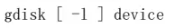
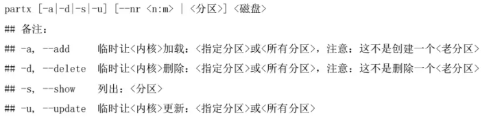
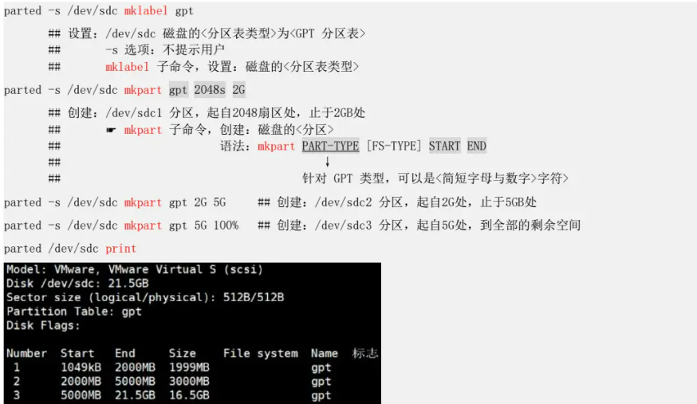
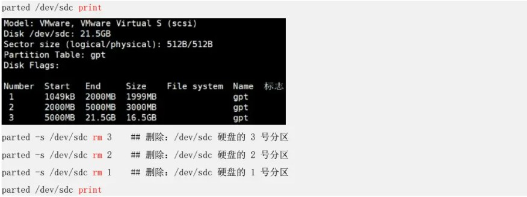
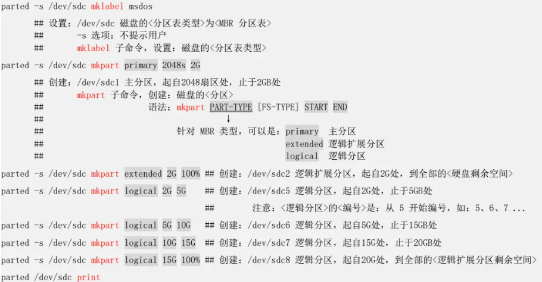
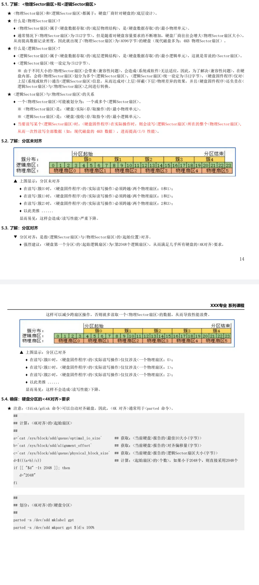

---

### 一、认识存储介质
此部分介绍存储设备的基础知识，包括物理构成和在 Linux 系统中的识别方式。

*   **存储介质类型**: 
	* **软盘**
	* **磁碟硬盘**
	* **U盘**
	* **SSD固态硬盘**
	* **磁带机**
	* **光盘**
*   **Linux 中的设备命名**:
    *   **IDE/PATA 硬盘**: `/dev/hd[a-z]` (已淘汰)
    *   **SCSI/SATA/SAS/USB 硬盘**: `/dev/sd[a-z]`
    *   **虚拟化硬盘 (KVM/Xen)**: `/dev/vd[a-z]`
    *   **光驱/CD-ROM**: `/dev/sr0` 或 `/dev/cdrom`

---

### 二、硬盘设备管理
此部分介绍如何在不重启系统的情况下，查看和管理物理硬盘设备。

*   **列出系统磁盘: `lsblk` 命令**
    *   **功能**: 以树状结构显示系统上所有块设备（硬盘、分区等）的信息。
    *   **核心示例**:
        ```bash
        lsblk
        ```

*   **热插入与热拔出: 扫描与移除 SCSI 设备**
    *   **功能**: 手动让内核重新扫描 SCSI 总线，以识别新添加的硬盘（热插拔）或安全移除硬盘。
    *   **示例 (添加新盘)**:
        ```bash
        # 扫描 host0 总线上的所有 channel、target、lun
        echo "- - -" > /sys/class/scsi_host/host0/scan
        ```
    *   **示例 (移除磁盘)**:
	    ```bash
        # 移除SCSI地址为 2:0:0:0 的设备
        echo 1 > /sys/class/scsi_device/2\:0\:0\:0/device/delete
        ``` 
    * **实际常用方法**：
		```bash
	    yum install sg3_utils -y
	    scsi-rescan -a     ##扫描：SCSI设备，从而识别新插入的SCSI设备
		```
    
---

### 三、分区表与分区工具
此部分讲解两种主流的分区表格式（MBR 和 GPT）以及管理它们的交互式工具。

*   **分区表格式: MBR vs. GPT**
    *   **MBR (Master Boot Record)**:
        *   传统格式，兼容性好。
        *   最大仅支持 **2TB** 的硬盘。
        *   最多支持 **4个主分区**（或3主分区+1扩展分区）。
        *   引导方式依赖 **BIOS**。
    *   **GPT (GUID Partition Table)**:
        *   现代格式，功能更强，更安全。
        *   支持大于 **2TB** 的硬盘。
        *   默认最多支持 **128个主分区**。
        *   引导方式依赖 **UEFI**。

*   **交互式分区工具: `fdisk` 与 `gdisk`**
    *   **`fdisk` (MBR 工具)**:
        *   **功能**: 用于管理 MBR 分区表的交互式工具，适用于小于等于 2TB 的分区。
        *   **语法**：
        *   **示例**: 
        *   **常用内部命令**:
            *   `p`: 打印分区表
            *   `n`: 新建分区
            *   `d`: 删除分区
            *   `t`: 更改分区类型 ID
            *   `w`: 保存并退出
            *   `q`: 不保存退出

    *   **`gdisk` (GPT 工具)**:
        *   **功能**: 用于管理 GPT 分区表的交互式工具，适用于大于 2TB 的分区。
        *   **语法**：
            
        *   **核心示例**: `gdisk /dev/sdc`
        *   **常用内部命令**: (与 `fdisk` 类似) `p`, `n`, `d`, `t`, `w`, `q`。

---

### 四、非交互式分区管理工具
此部分介绍可在脚本中使用的非交互式分区管理命令。

*   **`partx` 命令: 通知内核分区表变化**
    *   **功能**: 在使用分区工具修改分区表后，强制让内核重新读取分区信息，避免重启。![[Pasted image 20250912113519.png]]
    *   **语法**：
    *   **示例**: 
	    * 列出：`partx -s /dev/sda`
	    * 删除：`partx -d /dev/sdb`
	    * 添加：`partx -a /dev/sdb`
	    * 更新：`partx -u /dev/sdb`

*   **`parted` 命令: 强大的非交互式分区工具**
    *   **功能**: 一个功能强大的分区编辑器，支持 MBR 和 GPT，并且可以非交互式执行，非常适合自动化脚本。
    *   **示例 (创建硬盘 GPT 分区)**:
    *   **示例 (删除 GPT 分区)**:
    *   **示例 (创建硬盘 MBR 分区)**:
    *   **示例 (删除 MBR 分区)**:

---

### 五、分区4K对齐
此部分介绍一个重要的性能优化概念——分区对齐。
