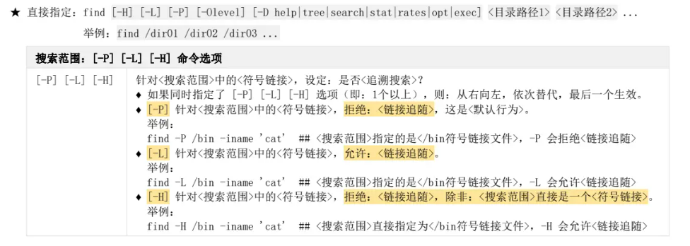
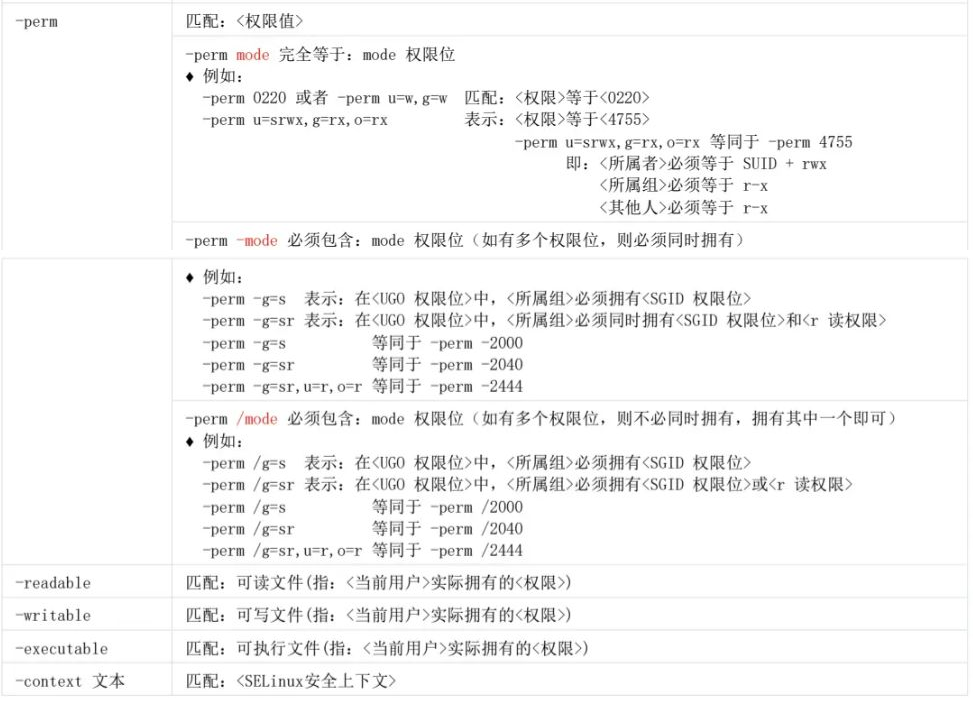

---

### 一、了解: 文件搜索命令
此部分简要介绍 Linux 中用于文件搜索的不同命令，各有侧重。

*   **`which` 命令 (简单方便)**
    *   **功能**: 在 `$PATH` 环境变量指定的目录中，搜索**可执行文件**的完整路径。
    *   **核心示例**:
    ```bash
    which cd
    ```

*   **`whereis` 命令**
    *   **功能**: 不仅在 `$PATH` 中搜索可执行文件，还会查找其对应的 `man` 帮助手册和源代码文件。
    *   **核心示例**:
        ```bash
        whereis cd
        ```

*   **`locate` 命令 (不常用)**
    *   **功能**: 依赖一个预先建立的数据库 (`mlocate.db`) 来快速查找文件。搜索速度极快，但不是实时搜索，需要定期更新数据库 (`updatedb`)。
    *   **核心示例**:
        ```bash
        locate shadow
        ```

*   **`find` 命令 (最强大)**
    *   **功能**: 在指定的目录树中进行实时、递归的搜索。功能极其强大，可以根据文件的各种属性（名称、时间、大小、权限等）进行查找，并对找到的文件执行指定的操作。
    *   **语法**: `find [搜索路径] [搜索条件] [处理动作]`

---
### 二、find搜索范围



---
### 三、按条件搜索: `find` 命令的核心用法
此部分详细列举 `find` 命令中基于不同文件属性的搜索条件。

*   **根据名称与 inode 搜索**
    *   -`name "PATTERN"`: 按文件名精确匹配。
    *   -`iname "PATTERN"`: 按文件名匹配，忽略大小写。
    *   -`inum <inode号>`: 按 inode 号码查找。
    *   **核心示例**:
        ```bash
        find /etc -iname "host*"
        ```

*   **根据文件所有者与组搜索**
    *   -`user <用户名>`: 按文件所有者查找。
    *   -`group <组名>`: 按文件所属组查找。
    *   -`uid <UID号>`: 按用户 ID 查找。
    *   -`gid <GID号>`: 按组 ID 查找。
    *   -`nouser`: 查找没有有效所有者的文件。
    *   **核心示例**:
        ```bash
        find /home -user user01
        ```

*   **根据文件时间戳搜索**
    *   -`mtime <天数>`: 按文件**内容**修改时间 (modify time)。
    *   -`ctime <天数>`: 按文件**状态**改变时间 (change time)。
    *   -`atime <天数>`: 按文件**访问**时间 (access time)。
    *   `+n`: n 天之前；`-n`: n 天之内；`n`: 恰好第 n 天。
    *   **核心示例 (查找24小时内内容被修改过的文件)**:
        ```bash
        find /etc -mtime -1
        ```

*   **根据文件类型与大小搜索**
    *   -`type <类型>`: `f` (普通文件), `d` (目录), `l` (链接文件)等。
    *   -`size <大小>`: `+` (大于), `-` (小于), 无符号 (等于)。单位 `c`(字节), `k`(KB), `M`(MB), `G`(GB)。
    *   **核心示例 (查找 `/tmp` 下大于 10MB 的文件)**:
        ```bash
        find /tmp -type f -size +10M
        ```

*   **根据文件权限搜索**
    *   -`perm <模式>`: 精确匹配权限。
    *   -`perm -<模式>`: 文件权限必须**完全包含**指定模式 (如 `ugo` 权限都要满足)。
    *   -`perm /<模式>`: 文件权限**包含任意一个**指定模式即可 (常用，`or` 的关系)。
    * 
    *   **核心示例 (查找所有用户都有写权限的文件)**:
	```bash
     find /tmp -perm -222
	```

---

### 四、条件组合与处理动作
此部分介绍如何将多个搜索条件组合起来，并对搜索结果进行处理。

*   **条件组合 (逻辑运算)**
    *   -`a` (and): 多个条件同时满足 (默认)。
    *   -`o` (or): 多个条件满足任意一个即可。
    *   `!` 或 `-not`: 对条件取反。
    *   **核心示例 (查找 `/tmp` 下非目录或者权限为 777 的文件)**:
        ```bash
        find /tmp \! -type d -o -perm 777
        ```

*   **处理动作 (对结果的操作)**
    *   -`print`: 显示：<匹配对象>的<名称、绝对/相对路径>，这是一个默认动作，可以省                      略，用于：标准输出<find匹配对象>。
    *   -`ls`: 列出：<匹配对象>的<详细信息>，<-ls动作>等价于<ls-dlis命令>。
    *   -`delete`: 删除：<匹配对象>。
    *   -`prune`: 设置：如果<匹配对象>是<目录>，则不要进入该<目录>。
    *   -`exec <命令> {} \;`: 对每个结果执行命令，不提示。`{}` 代表找到的文件名。
    *   **核心示例 (查找并删除所有 `.tmp` 文件)**:
        ```bash
        find / -type f -name "*.tmp" -delete 
	     ```
    *   **核心示例 (查找所有 `.log` 文件并用 `tar` 打包)**:
        ```bash
        find /var/log -name "*.log" -exec tar -zcf log.tar.gz {} +
        ```
        *(注：示例中使用 `+` 替代 `\;`，效率更高，会将多个结果一次性传递给命令)*