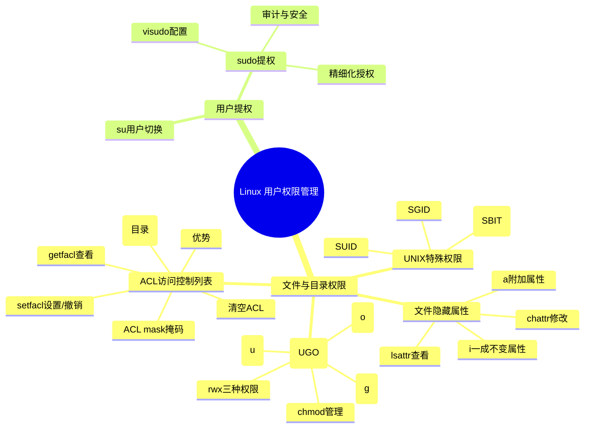
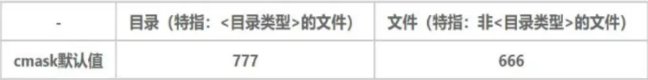
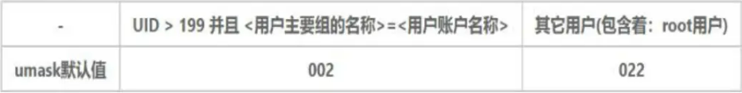
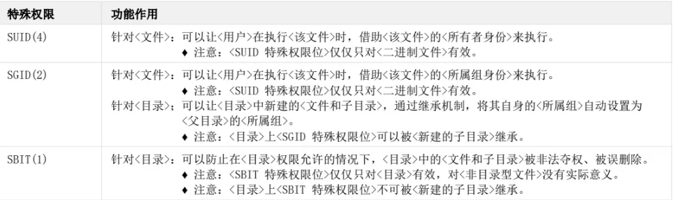
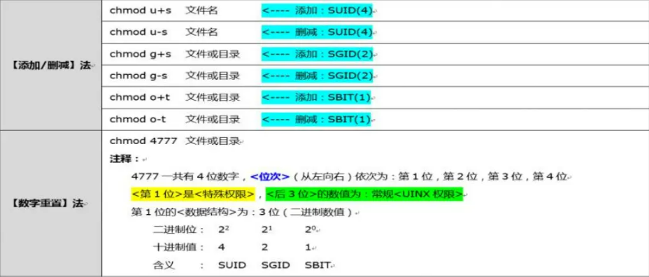
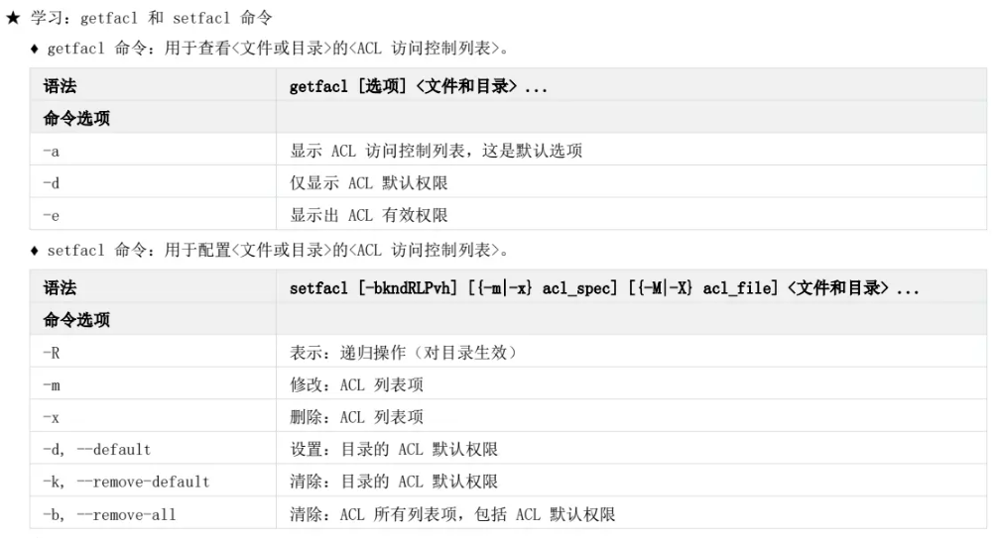
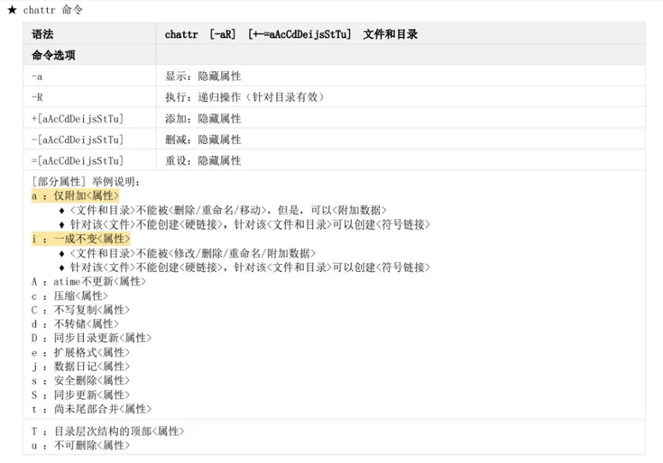

---


```text
Linux 用户权限管理
├── 文件与目录的权限
│   ├── UNIX 基本权限（UGO 权限）
│   │   ├── 权限类型：r（读）、w（写）、x（执行）
│   │   ├── 作用对象：u（所有者）、g（所属组）、o（其他用户）
│   │   ├── 对文件的影响：r=读文件内容，w=写文件内容，x=执行文件
│   │   ├── 对目录的影响：r=列出目录，w=创建/删除文件，x=进入目录
│   │   └── 管理命令：chmod（查看、添加、撤销、重置）、chown（更改所有者/组）
│   │
│   ├── UNIX 特殊权限
│   │   ├── SUID：执行程序时获得文件所有者的权限（例：passwd）
│   │   ├── SGID：目录中新建文件继承目录的组
│   │   └── SBIT (Sticky)：目录中用户只能删除自己的文件（例：/tmp）
│   │
│   ├── ACL（访问控制列表）
│   │   ├── 优势：精细化控制，突破 UGO 限制
│   │   ├── 常用命令
│   │   │   ├── getfacl：查看 ACL
│   │   │   ├── setfacl：设置 ACL
│   │   │   ├── -x：撤销 ACL
│   │   │   ├── -b：清空 ACL
│   │   │   └── -m d:：设置目录默认继承 ACL
│   │   └── ACL mask：限制 ACL 最大权限
│   │
│   └── 文件隐藏属性
│       ├── 工具：lsattr（查看）、chattr（修改）
│       ├── +a：仅允许追加写入（日志）
│       └── +i：文件不可修改/删除（连 root 也不行，需先解除）
│
└── 用户提权
    ├── su 用户切换
    │   ├── su -：切换到 root
    │   └── su user：切换到普通用户
    │
    └── sudo 用户提权
        ├── visudo：配置授权
        ├── sudo cmd：以 root 身份执行命令
        ├── 优点
        │   ├── 精细化授权
        │   ├── 不暴露 root 密码
        │   └── 可记录日志，方便审计

```


## 一、文件与目录的权限

### 1. UNIX 基本权限（UGO 权限）

- **权限类型：**
    
    - `r`（read） 读
    - `w`（write） 写
    - `x`（execute） 执行
        
- **作用对象：**
    
    - `u`（user，所有者）
    - `g`（group，所属组）
    - `o`（others，其他用户）
        
- **对文件的影响：**
    
    - `r`：可查看文件内容
    - `w`：可修改文件内容
    - `x`：可执行文件
        
- **对目录的影响：**
    
    - `r`：可查看目录下文件列表
    - `w`：可创建/删除/改名目录下文件
    - `x`：可进入目录（cd）
	     可查看目录中子文件和子目录的属性信息
        

**UGO初始权限生成机制**

*   **了解：** 什么是 `cmask` 和 `umask`?
    *   `cmask` 掩码: 决定需要默认创建的 `<权限位>`。
    *   `umask` 掩码: 决定需要默认屏蔽的 `<权限位>`。

*   **了解：** Linux 系统中的 `cmask` 和 `umask` 的默认值
	* cmask 默认值
		出于安全考虑，Linux系统针对\<非目录类型的文件>，默认不授予执行权限
		
	* umask 默认值
		

*   **了解：** UNIX 初始权限的生成机制
     
	


**权限管理：`chmod`**


```bash
# 查看权限
ls -l file.txt

# 添加权限
chmod u+x file.sh

# 撤销权限
chmod g-w file.txt

# 重置权限 不要使用-
chmod 644 file.txt
chmod u=w file.txt
chmod u=-w- file.txt #无效

# 更改所有者和组 -R递归操作用于目录
chown user file.txt
chown :group file.txt
chown user:group file.txt
```

---

### 2. UNIX 特殊权限

- **SUID(4)**：执行程序时临时获得文件所有者的权限
    - 示例：`chmod u+s /usr/bin/passwd`    
    - 作用：普通用户可修改密码（需要写 /etc/shadow）   
- **SGID(2)**：应用于目录，新建文件继承目录的用户组
    - 示例：`chmod g+s /project`    
- **SBIT(1)**：目录下用户只能删除自己的文件
    - 示例：`chmod +t /tmp`    





---

### 3. ACL（访问控制列表）

**优势：**

- 可对单个用户/组设定权限，突破 UGO 的限制
    

**常用命令：**


```bash
# 查看 ACL
getfacl file.txt

# 设置 ACL
setfacl -m u:tom:rw file.txt
setfacl -m g:dev:r file.txt

# 删除 ACL
setfacl -x u:tom file.txt

# 清空 ACL
setfacl -b file.txt
```

**默认 ACL（目录继承）：**

```bash
setfacl -m d:u:tom:rw /data   # 子文件自动继承
```

**ACL 掩码（mask）：**

- 限制 ACL 的最大权限
    
- 修改 mask 时，可能会降低原来设置的权限
    

---

### 4. 文件隐藏属性

通过 **lsattr/chattr** 管理。

- **查看属性：**
    
| 语法   | lsattr [-aR] 文件和目录                    |
| ---- | ------------------------------------- |
| 命令选项 |                                       |
| -a   | 列出：<目录>中所有的<文件和子目录>的隐藏属性(包括隐藏文件和隐藏目录) |
| -d   | 仅显示：<目录>自身的<隐藏属性>                     |
| -R   | 执行：递归操作<针对目录有效>                       |

```bash
lsattr file.txt
```

- **设置属性：**
	

```bash
# 追加属性（a：仅追加写入）
chattr +a logfile

# 一成不变属性（i：不可修改/删除）
chattr +i important.txt
```

- **验证案例：**
    
    - `+a` 文件只能追加数据，不能覆盖/删除
        
    - `+i` 文件彻底锁死，连 root 也不能修改/删除（需先解除）
        

---

## 二、用户提权

### 1. su 用户身份切换

- **不完整登录**
```bash
	su username
```
- **完整登录**
```bash
	su - username 或 su -l username
```
### 2. sudo 用户提权


- **使用：**
    

```bash
sudo shutdown -h now
```

- **特点：**
    
    - 只授予指定命令权限，不暴露 root 密码
        
    - 可记录日志，方便审计
        

---

