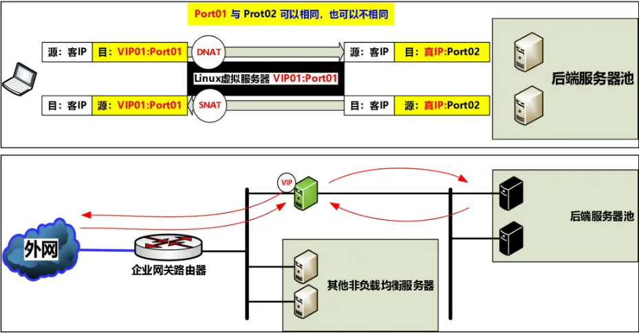
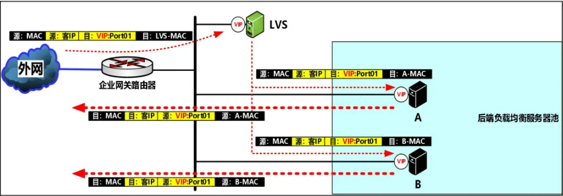
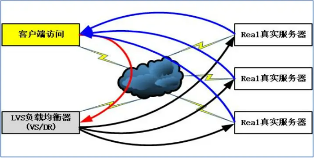

---

### **第一部分：负载均衡集群 (Load Balancing Cluster)**

负载均衡集群的目标是将客户端的请求分发到后端的多台服务器上，以提高服务的处理能力、可用性和扩展性。文档主要介绍了两种主流的负载均衡技术：**LVS** 和 **Nginx**。

**1. LVS (Linux Virtual Server)**

*   **定位**：工作在 **网络层/传输层（四层）** 的负载均衡器，性能极高，因为它只做报文的转发，不关心应用层内容。
*   **核心工作模式**:
    *   **NAT 模式 (三层内联)**：
	    * 
        *   **原理**：请求和响应报文都必须经过LVS调度器。调度器将请求报文的目标IP（DNAT）和目标端口修改后转发给后端真实服务器，响应报文源IP（SNAT）被修改后返回给客户端。
        *   **特点**： 
			1. 重要特征:<IP地址>的<NAT网络地址转换>是关键。
			2. 必须具备:NAT网关功能。
			3. 网卡需求:双网卡。
				* 前端网卡<入站>:做<PREROUTING DNAT 目标地址转换>。
				* 前端网卡<出站>:做<POSTROUTING SNAT 源地址转换>。
			4. 性能瓶颈:将成为一个性能瓶颈,大量<后端回复的数据包>均需经过<负载均衡器>。
        *   **优缺点**：配置简单，但LVS本身成为网络瓶颈。
    *   **DR 模式 (二层旁路/直接路由)**：
	    * 
        *   **原理**：调度器只修改请求报文的目标MAC地址，将其转发给后端服务器。后端服务器处理完请求后，**直接将响应报文返回给客户端**，不再经过LVS调度器。
        *   **特点**：
		    1. 重要特征：直接路由转发
				    \<LVS 负载均衡器>在收到\<客户端 TCP/IP 请求包>之后，不会查询\<内核路由表>，而是通过\<ARP 广播>获得\<后端节点的真实 IP 地址>对应的\<MAC 地址>，然后用\<后端节点的 MAC 地址>作为\<目标 MAC 地址>，对\<客户端 TCP/IP 请求包>进行\<数据链路层>的\<重新封装>，最后将封装好的\<数据帧>重新发送到\<交换网络>中，利用\<后端节点的 MAC 地址>将\<数据帧>交换到\<后端节点>，从而完成\<负载均衡调度>工作。
				    **注意1**：\<数据帧>重新封装后，\<目标IP地址>仍然是\<VIP>，不会变为\<后端节点的真实 IP 地址>。
				    **注意2**：\<后端节点>必须配置\<相同的 VIP>，否则就不会接收\<客户端 TCP/IP 请求包>。
				    **注意3**：\<后端节点>不可针对\<VIP 地址>作为\<ARP 应答>，否则\<客户端>会绕过\<LVS>。
		    2. 无需具备: Forward 内核路由转发功能。
		    3. 网卡需求：单网卡。
		    4. 不影响\<现有的网络结构>。
		    5. 性能强悍：仅将\<前端请求数据包>负载均衡调度到\<后端>，无需承载大量的\<后端回复数据包>。
		    6. VLAN 限制: 由于\<LVS>与\<后端>之间是纯粹的\<二层交换传输方式>，因此\<LVS 网卡>与\<后端节点网卡>必须同属一个 VLAN。
        *   **优缺点**：性能最高，是生产环境中最常用的模式。配置相对复杂，需要处理ARP问题（抑制ARP响应）。
    *   **TUN 模式 (三层旁路/IP隧道)**:
		* 
        *   **原理**：基本与DR类似，不同点在于：采用\<源IP>和\<真实RIP>对\<客户端访问数据包>进行\<二次封装>。在LVS和后端服务器之间建立IP隧道，不常用。
        *   **特点**：
	        1. 网卡需求：单网卡。
	        2. 性能高效：不会成为一个性能瓶颈，\<后端回复数据包>无需经过\<LVS 负载均衡器>。
	        3. 不影响\<现有的网络结构>。
	        4. 适用于：跨 VLAN、路由、NAT 任意场景。
*   **调度算法**：
    *   提供了多达10种调度算法来决定如何分配请求：
        *   **rr (轮询)**: 公平分配给每台服务器。
        *   **wrr (加权轮询)**: 根据服务器性能权重分配。
        *   **lc (最少连接)**: 将请求分给当前连接数最少的服务器。
        *   **wlc (加权最少连接)**：在最少连接的基础上，根据服务器的权重进行分配。
        *   **sed (最短预期延迟)**：基于 wlc 算法的改进，关心未来选择最抗压的。
        *   **nq (无须队列等待)**：如果没有活跃链接就立即分配，其他与sed算法一样。
        *   **lblc (局部性最少连接)**：谁缓存了内容就一直用谁。
        *   **lblcr (带复制调度的局部性最少连接)**：基于 wlc 算法的改进，谁缓存了内容，如果太忙就找帮手一起干。
        *   **dh (目标地址散列)**：根据请求的目标IP地址进行哈希计算，并将请求分发到匹配的服务器。
        *   **sh (源地址散列)**: 根据请求的源IP地址进行哈希计算，并将请求分发到匹配的服务器。
*   **管理工具**：
    *   使用 `ipvsadm` 命令来创建和管理LVS的转发规则。

**2. Nginx**

*   **定位**：工作在 **应用层（七层）** 的负载均衡器，通常作为HTTP反向代理。功能强大，配置灵活。
*   **核心模块**:
    *   **`upstream` 模块**:
        *   用于定义一组后端服务器（Server Pool）。
        *   支持多种调度算法（`round-robin`, `least_conn`, `ip_hash` 等），并可以通过 `weight` 参数设置权重。
        *   可以实现动静分离，将动态请求（如php）和静态请求分发到不同的后端服务器组。
    *   **`stream` 模块**:
        *   让Nginx也能实现四层（TCP/UDP）负载均衡。
*   **特点**：
    *   作为七层代理，可以根据URL、HTTP头等信息进行更智能的请求分发。
    *   可以实现SSL卸载、内容缓存、URL重写等高级功能。
    *   相较于LVS，性能稍低，但功能性和灵活性远超LVS。

---

### **第二部分：高可用集群 (High Availability Cluster)**

高可用集群的目标是消除单点故障（SPOF），确保在某个节点出现故障时，服务能够自动切换到备用节点，从而不中断对外服务。文档主要介绍了 **Keepalived** 技术。

**1. Keepalived**

*   **核心功能**：实现服务的高可用和故障转移。
*   **核心协议**：
    *   **VRRP (虚拟路由冗余协议)**：通过选举机制（基于优先级和心跳检测），在多个节点中选举出一个 **MASTER** 节点。
    *   MASTER节点拥有一个**虚拟IP (VIP)**，对外提供服务。
    *   其他节点为 **BACKUP** 状态。当MASTER节点故障时，BACKUP节点会通过VRRP选举接管VIP，成为新的MASTER。
*   **关键特性**：
    *   **健康检测**：可以通过执行脚本（`track_script`）或检测网络接口状态来判断服务或节点是否正常。如果检测到异常，会触发主备切换。
    *   **故障转移**：自动化的主备切换过程，对客户端透明。

---

### **第三部分：组合架构：负载均衡 + 高可用**

这是生产环境中最经典的架构，将负载均衡和高可用技术结合起来，实现一个既能分散流量压力又能防止单点故障的强大集群。

**1. Keepalived + LVS (双机主备)**

*   **架构**：部署两台LVS服务器，都安装Keepalived，组成一个高可用集群。
*   **工作流程**:
    *   一台LVS服务器作为MASTER，持有VIP并负责流量分发。
    *   另一台作为BACKUP，实时监控MASTER的状态。
    *   当MASTER LVS服务器宕机时，BACKUP服务器会立即接管VIP，继续提供负载均衡服务。
    *   这样就解决了LVS调度器本身的单点故障问题。

**2. Keepalived + Nginx (双机主备)**

*   **架构**：与LVS类似，部署两台Nginx服务器，并使用Keepalived实现高可用。
*   **工作流程**：
    *   VIP漂浮在两台Nginx服务器之间。
    *   正常情况下，MASTER Nginx负责反向代理和负载均衡。
    *   当MASTER Nginx故障时，BACKUP Nginx接管VIP，成为新的流量入口。
    *   这解决了Nginx负载均衡器的单点故障问题。

### **总结**

这套文档从理论到实践，清晰地勾勒出了构建现代Web应用基础架构的路线图：

1.  **入门 (简介)**：理解集群的基本概念——负载均衡和高可用。
2.  **横向扩展 (负载均衡)**：学习使用LVS（四层）和Nginx（七层）来分散请求压力，提升系统吞吐量。
3.  **纵向加固 (高可用)**：学习使用Keepalived来消除服务入口的单点故障。
4.  **实战整合 (组合架构)**：将**Keepalived**与**LVS/Nginx**结合，构建出生产环境中常见的高性能、高可用的服务集群。