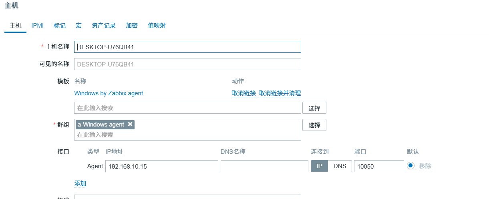
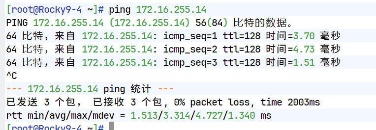
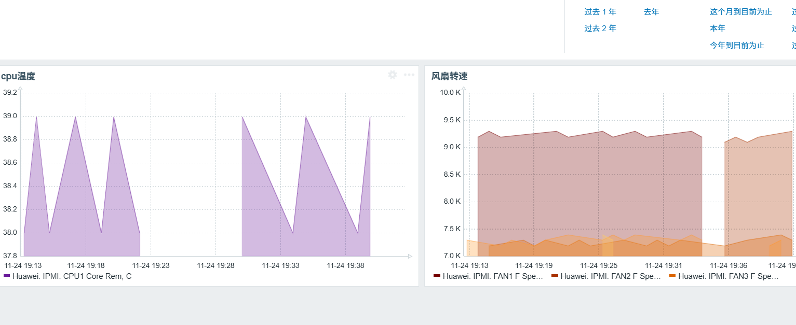

## 问题
1. Zabbix 如何监控：Windows CPU、内存、网卡流量、磁盘容量 
2. Zabbix 如何监控：新华三交换机、路由器 CPU、内存、指定接口流量 
3. Zabbix 如何监控：服务器物理性能状态（如：风扇转速、CPU温度）

## 前提环境准备：ansible部署zabbix项目实验完成
## 问题一
### 操作流程
#### windows安装zabbix agent2服务
指定配置文件中的server和serverActive为虚拟机的zabbix server ip

#### 在web端创建主机添加windows主机

**注意：这个接口的agent ip地址不是本机连接网络的ipv4地址，而是相对于虚拟机而言的本机ip地址，即VMnet8虚拟网卡设置的ip地址**

#### 创建windows仪表盘并插入图表


## 问题二
### 操作流程
#### 交换机
##### 开启snmp-agent
```
snmp-agent
snmp-agent sys-info version v2c
snmp-agent community read zabbix123
snmp-agent community write zabbix123
display snmp-agent community
```
##### 给交换机vlan10上设置ip，让zabbix server可以连接到交换机

##### 在zabbix web端上创建主机，链接模板

##### 创建仪表盘插入图表

#### 路由器
##### 查看网络连通性

##### 开启snmp-agent
```
snmp-agent
snmp-agent sys-info version v2c
snmp-agent community read zabbix123
snmp-agent community write zabbix123
display snmp-agent community
```
##### web端上创建主机并链接模板

##### 创建仪表盘并插入图表

## 问题三
### 操作流程
##### 设置zabbix server IPMI 轮询器进程数量
```
vi /etc/zabbix/zabbix_server.conf

StartIPMIPollers=5

```
##### web端创建主机并链接模板


##### 创建仪表盘插入图表
