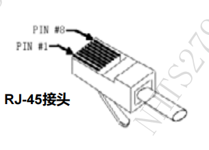
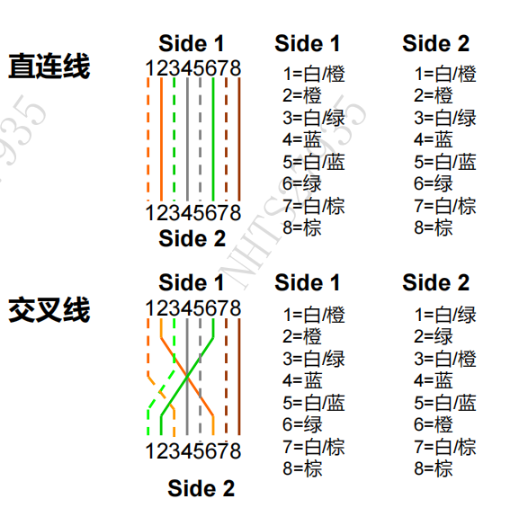

### 一、双绞线基本概念

*   **定义:** 一对双绞线 (twisted pair) 由两根具有绝缘保护层的铜导线组成。
*   **特点:** 两根导线再按一定密度相互绞在一起，就可改变导线的电气特性，降低信号干扰的程度。
*   **构成:** 双绞线通常为 8 芯 (4 对) 构成一根电缆。

### 二、双绞线类型

双绞线分为：

*   **UTP (Unshielded Twisted Pair):** 无屏蔽双绞线。 UTP 成本低，应用普遍，在大多数中小企业内部局域网、网吧、家庭中均使用 UTP。
*   **STP (Shielded Twisted Pair):** 屏蔽双绞线。STP 配有类似于同轴电缆的屏蔽功能，价格相对高一些，安装比无屏蔽双绞线电缆困难。

### 三、双绞线分类（按单位长度内绞环数的不同）

常见的双绞线可分为 **3 类 UTP、4 类 UTP、5 类 UTP、超 5 类 UTP 和 6 类 UTP** 等。其中 **5 类 UTP 应用尤为广泛。**
（**超6、7**）
### 四、双绞线连接方式

*   双绞线的**直连线**和**交叉线**线序如下图所示：  （见下图）

*   **现状：** 早期以太网中，各种设备网卡接口类型不同，互相连接时可能需要不同的线序。**但目前绝大多数网络设备都支持网卡接口类型自适应，在连接时不必考虑所用网线为直连线还是交叉线。**

### 五、图示：直连线与交叉线线序

**直连线**

| 线芯 | Side 1 | Side 2 |
|---|---|---|
| 1 | 白/橙 | 白/橙 |
| 2 | 橙 | 橙 |
| 3 | 白/绿 | 白/绿 |
| 4 | 蓝 | 蓝 |
| 5 | 白/蓝 | 白/蓝 |
| 6 | 绿 | 绿 |
| 7 | 白/棕 | 白/棕 |
| 8 | 棕 | 棕 |

**交叉线**

| 线芯 | Side 1 | Side 2 |
|---|---|---|
| 1 | 白/橙 | 白/绿 |
| 2 | 橙 | 绿 |
| 3 | 白/绿 | 白/橙 |
| 4 | 蓝 | 蓝 |
| 5 | 白/蓝 | 白/蓝 |
| 6 | 绿 | 橙 |
| 7 | 白/棕 | 白/棕 |
| 8 | 棕 | 棕 |

---

